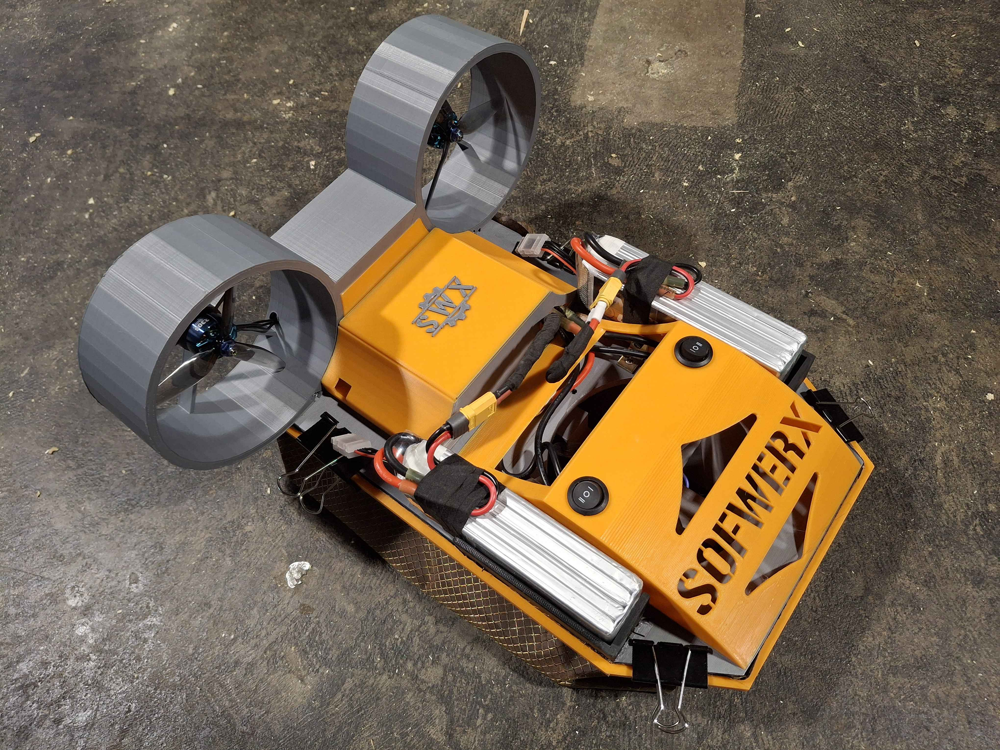

  

Communicates with a hovercraft. Writes PWM values between 1000 and 2000 to ESCs to control drone motors. the Lift motor fills the bag on the bottom of the hovercraft. The left and right motors are for forward movement. Of course, powering the left more than right causes a right turn and vice versa. This code expects values from the analog sticks of an NX6 drone controller. As such, the range of microsecond values from the receiver is typically about 1100 to 2000 us. This implementation assumes the arduino is not being used directly for RX and instead is wired to the AR637T receiver used with the controller.
